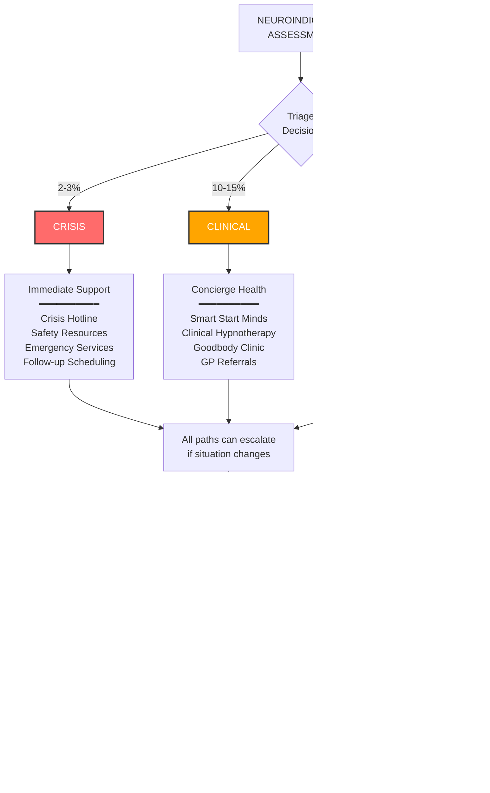

# Thrive Platform - Mermaid Diagrams

These diagrams render automatically in GitHub and can be embedded in web pages.

---

## 1. Thrive Platform Overview


---

## 2. Employee Journey - Complete Flow


---

## 3. Decision Tree - Routing Logic



---

## 4. Privacy Architecture - Data Separation


---

## 5. Assessment Intelligence - Core IP


---

## 6. Content Routing Logic - OCEAN to Recommendations


---

## 7. LEGO Pieces Status


---

## 8. Build Timeline Options


---

## How to Use These Diagrams

### In GitHub
Just paste the markdown - Mermaid renders automatically!

### In HTML
Add this script tag and use `<div class="mermaid">` blocks:

```html
<script src="https://cdn.jsdelivr.net/npm/mermaid/dist/mermaid.min.js"></script>
<script>mermaid.initialize({ startOnLoad: true });</script>

<div class="mermaid">
graph TD
    A[Start] --> B[End]
</div>
```

### In Documentation Tools
- **Notion**: Paste the code blocks
- **Obsidian**: Install Mermaid plugin
- **GitBook**: Native support
- **Confluence**: Install Mermaid macro

### Export as Images
Use https://mermaid.live to:
- Edit diagrams visually
- Export as PNG/SVG
- Share public links

---

## Customization

You can customize colors, styles, and themes. See [Mermaid docs](https://mermaid.js.org/) for full syntax.

**Common customizations:**

